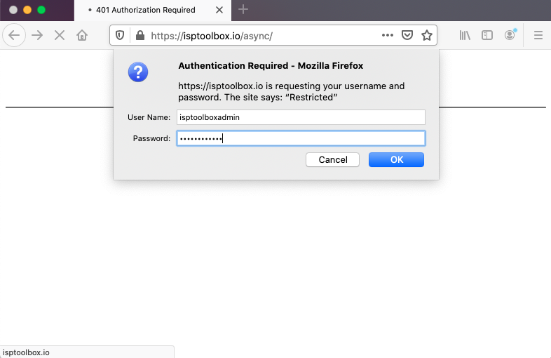

# ISP Toolbox Webserver
ISP Toolbox Backend Server Code
- powers market evaluator, network cost comparison
- hosted: AWS, EC2
- database: AWS Postgres
- KV store: Elasticache
- domain: https://fbctower.com

## Getting Dev Environment Setup
- get AWS account `fbc-tower-design` - bunnylol aws
- create EC2 instance from template
- chmod 400 on .pem file
- ssh using the isptoolbox.pem in the /terraform folder
- install docker and docker compose
- ensure docker daemon is running (dockerd)
- clone git repository
    - make sure you clone all submodules `git submodule update --init --recursive`
- `make debug` to run locally on localhost:8000
## Make command list
`make setup`
- Installs required packages on system. Should only need to be ran once during first-time setup.

`make update`
- Updates and/or installs python packages as definred in requirements.txt via pip.

`make makemigrations`
- Creates django migrations for model changes.

`make migrate`
- Performs django migrations for model changes.

`make run`
- Starts the webserver.

`make debug`
- runs backend in debug configuration. attach to django using vscode

## Running fbctower locally with WWW OnDemand

1. On your EC2 instance

    `make debug`

this will startup the whole backend stack on your machine

in VSCode forward port 8000 to your localhost (macbook)


2. On your WWW OnDemand

Update the domain and protocols in `XIspToolboxControllerConfig.php`

```
const ISPTOOLBOX_BACKEND_DOMAIN = 'localhost:8000'; //@nocommit 'isptoolbox.io';
const ISPTOOLBOX_BACKEND_PROTOCOL = 'http://'; //@nocommit 'https://';
const ISPTOOLBOX_BACKEND_WS_PROTOCOL = 'ws://'; //@nocommit 'wss://';
```

## Pushing New Images to Production

Option 1: Github action
1. push latest code change to github master branch, wait for workflow to complete successfully. Make sure aws cli is configured locally -

    ``` git push origin master```

    ```aws configure```

2. deploy images to ecs

    ```./scripts/deploy_latest_image_to_prod.sh```

Option 2: Scripts for manual push (something broke)

1. login to AWS and ECR repository

    ```aws configure```

    ```aws ecr get-login-password --region us-west-1 | docker login --username AWS --password-stdin 623762516657.dkr.ecr.us-west-1.amazonaws.com```

2. build docker images locally and change tags, push to ecr

    ```./scripts/buildnpush.sh```

3. deploy images to ecs

    ```./scripts/deploy_latest_image_to_prod.sh```

## Debugging Django Tests with VSCode
add the following to your test:

```
import ptvsd # @nocommit - vscode python debugger
ptvsd.enable_attach(address=('0.0.0.0', 3000))
ptvsd.wait_for_attach()
```
then run the following command:
```
docker-compose -f docker-compose.yml -f docker-compose.dev.yml run --service-ports django-app python manage.py test IspToolboxApp.<TestPath>
```

`--service-ports` makes port 3000 available for debugging

vscode debugger must attach before the test is run

## Locally run Django Webserver (Ubuntu) (Old steps, follow "Running fbctower locally with WWW OnDemand" unless you really need to run without docker)
### Configure system environment (once):
- `make setup`

Make sure to follow steps printed to console in order to set up a test postgres db. Find them here as well for convenience:
- `sudo -i -u postgres`
- `createdb django_test`
- `psql`
- ` \password postgres`

Set the password to "password"

### Install required packages:
- `make update`

### Perform django migrations:
- `make migrate`

### Run the Webserver:
- `make run`

### Building + Pushing new static Files
Make sure you commit the new staticfiles.json manifest file
- `make static_prod`

### Database Migrations (Standard Django Process)
Run when you have made changes to or added to Django Models.
- `make makemigrations`
- `make migrate`

Test changes locally and unit test if applicable.

Once you're ready to push database schema changes to production:

The latest environment variables are in the `terraform/variables.tf` file


## Troubleshooting:

### My code works on my dev server but not on the prod image!

1. pull the docker image from AWS ECR

`docker pull 623762516657.dkr.ecr.us-west-1.amazonaws.com/isptoolbox-django`

2. set the environment to point to the production database (create a .env file)

`.env`
```
DB_NAME=
DB_PASSWORD=
DB_USERNAME=
DEBUG=True
POSTGRES_DB=
REDIS_BACKEND=
```

3. run the following command:

`docker run --env-file .env -p 0.0.0.0:8000:8000 -p 127.0.0.1:3000:3000 623762516657.dkr.ecr.us-west-1.amazonaws.com/isptoolbox-django:latest python manage.py runserver 0.0.0.0:8000`

## Administrative
### M-Lab
- Make BigQueries on M-Lab data [here](https://www.measurementlab.net/data/docs/bq/quickstart/#subscribe-your-google-account-to-the-m-lab-discuss-group)
- M-Lab BigQueries require a google account in M-Lab's discuss group
- FB Google accounts don't allow access to google groups
- Use this account to access instead:
    - Username: isptoolboxmlab@gmail.com

## Overlay Update
### Update Mapbox source on public."Overlay_overlay" Table

*Below are example of SQL Commands*

Example of rdof, tower, and communityConnect
```
INSERT INTO public."Overlay_overlay"(type, source_url, source_layer, created)
VALUES ('rdof', 'mapbox://alexychong.9r5cne0h', 'auction_904_final_simplified-1qpgm7', NOW())


INSERT INTO public."Overlay_overlay"(type, source_url, source_layer, created)
VALUES ('tower', 'mapbox://victorleefb.9l1ok6po', 'towerLocator-3rfxut', NOW())


INSERT INTO public."Overlay_overlay"(type, source_url, source_layer, created)
VALUES ('communityConnect', 'mapbox://alexychong.bp1lmhp5', 'calculated-cc-speeds-shp-casfao', NOW())
```
### Alternatively:

create sample overlay objects in your sandbox:

`make default_objects`

## Async Task Monitoring with Flower (pronounced flow-er)
 url: isptoolbox.io/async/

 username: isptoolboxadmin

 password: wisplover123

 

 ### Inspect Running / Queued / Failed Jobs


## Why isn't my LiDAR / 3D view loading?

- Check that potree static files are being pulled and are not 404ing
    - if they are you need to recursively clone submodules (potree is a submodule)
- Check that you have the lidar boundaries loaded in your database
    - `make default_objects`
